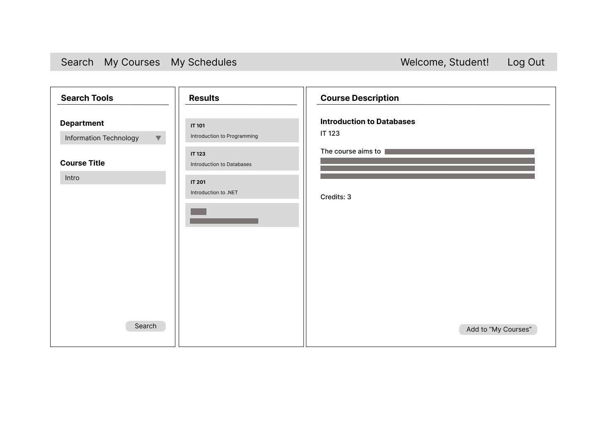
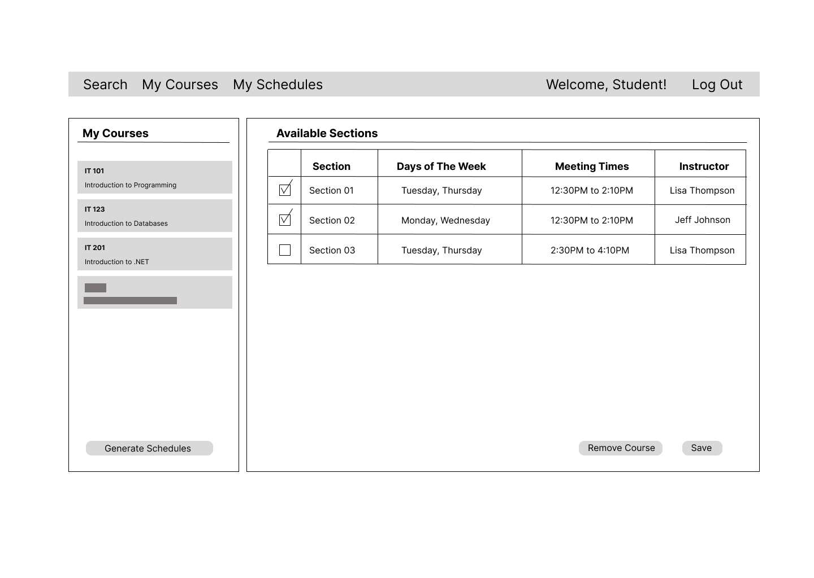
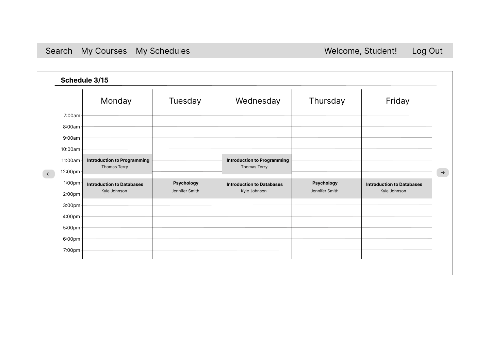
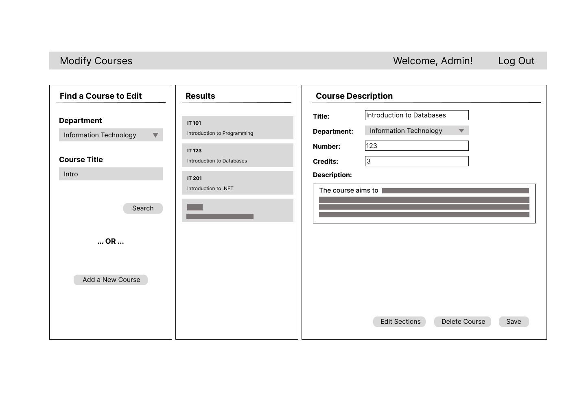
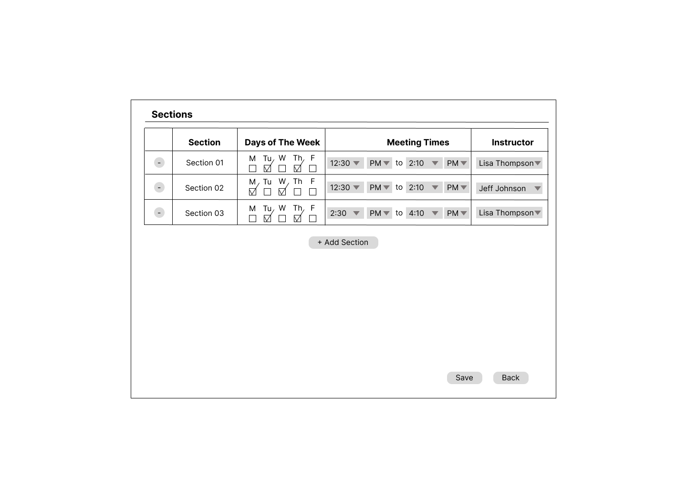
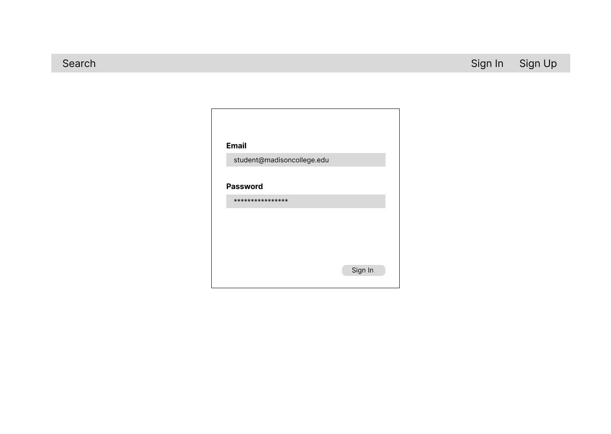
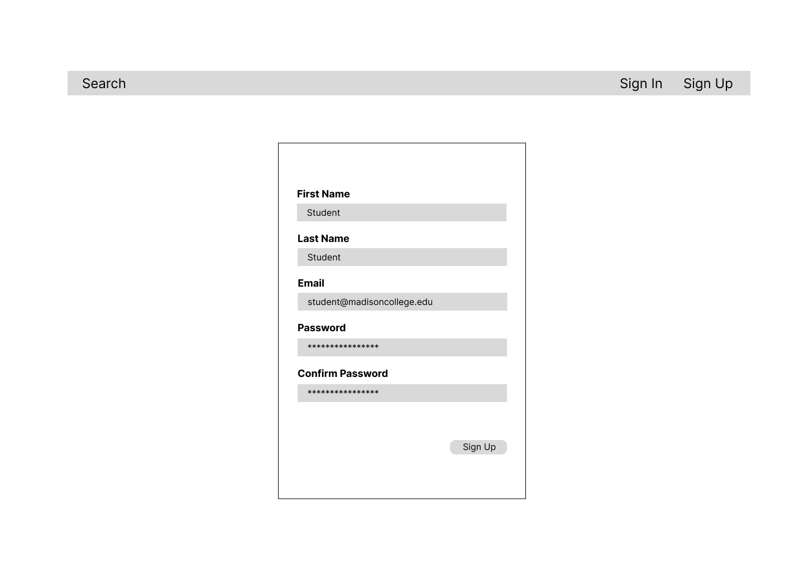

# Mockups of Application Screens

## Search Courses and View Course Information Page
Any user can search for a course, pick on of the courses that come up, and view its description.

## My Courses Page
Registered users can add courses to "My Courses" and choose course sections that they want to be considered for schedule generation.

## My Schedules Page
Registered users can view all the schedules that they generated.

## Modify Courses Page
Administrators can add new courses, edit information about the existing ones, and remove courses.

## Section Edit Overlay
Administrators can add / edit / remove sections for each of the existing courses. This is meant to be an overlay or a modal window that comes up on top of "Modify Courses" page.

## Sign In Page
Registered users can log in.

## Sign Up Page
Users can register to use course scheduling features.

